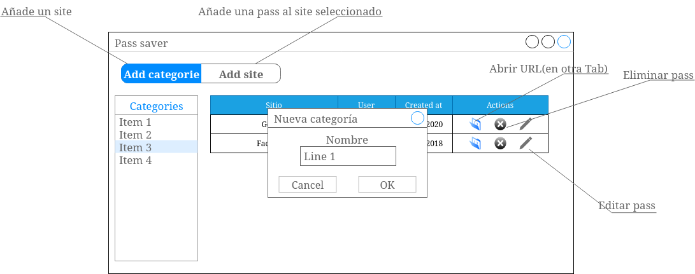

# PassSaver

El objetivo del proyecto es crear un gestor de contraseñas.
Dicho gestor de contraseñas nos permitirá almacenar URLs para distintos sitios.
Así mismo, nos permitirá organizar las contraseñas por categorías.

## Funcionalidad

* Añadir una nueva categoría
* Eliminar una categoría
* Visualizar los sites de una categoría
* Añadir un nuevo site a una categoría
* Editar un site
* Eliminar un site

A la hora de añadir una categoría, serán obligatorios los siguientes campos:
* Nombre

A la hora de añadir un site, serán obligatorios los siguientes campos:
* Nombre
* User
* Password

## Mockups
A continuación se muestran unos diseños orientativos sobre el diseño de la aplicación

Pantalla principal de la aplicación.

Al añadir una nueva categoría, simplemente preguntaremos el nombre

Pantalla para añadir/editar una nueva entrada:

Cada uno de las pantallas será una página distinta, sin necesidad de tener que recargar datos ni modificar el DOM.

## Requisitos técnicos

Aplicación web formada por el front-end con la capa de presentación y el back-end con la capa de procesado de datos.

### Front-End
* Definir las pantallas en 2 archivos html independientes
* Cada pantalla llevará su JS
* No utilizar JS dentro del HTML
* Para las operaciones de invocación al API, utilizar fetch

### Back-End
* API REST desarrollada .Net Core 3.1
* Publicación de la API en un App Service de Azure desde donde se expondrá la API al front-end
* Documentación de la API bajo es estándar OpenApi mediante Swagger. Deberá permitir poder importar la API como colección en Postman para ser testeada, así como exponer un interfaz que permita interactuar con la API directamente desde el navegador Web.

## Bonus

* Explorar todas las opciones que ofrece Swagger en lo referente a documentación añadiendo descripciones de controladores, métodos, parámetros, etc.
* Implementación del verbo PATCH según el estandar REST haciendo uso Microsoft.AspNetCore.JsonPatch.
* Configuración CORS para permitir recibir llamadas en la API únicamente desde el frontal propio.

