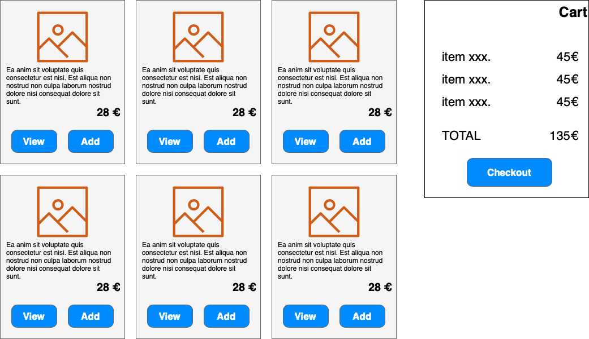
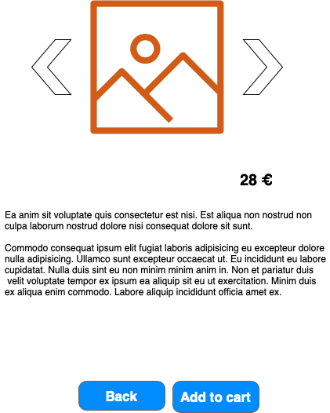
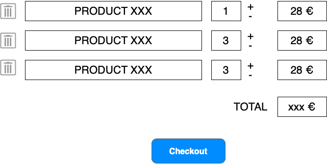
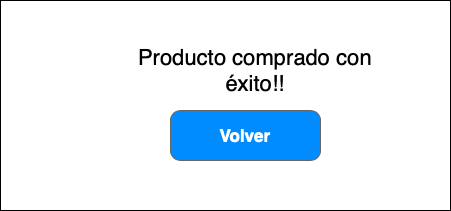

# eCommerce

El objetivo del proyecto es crear un pequeño comercio online.
Dicho comercio nos permitirá listar un conjunto de productos de la tienda, añadirlos a nuestro carrito y realizar la compra

## Funcionalidad

### Listado de productos
Pantalla principal de la aplicación.

Se mostrará un listado de productos, con su descripción breve y el precio. En la página también se muestra un mini-carrito con el resumen actual del pedido.

`EXTRA: implementar mecanismos de paginación`

### Añadir un producto al carrito

Al pulsar sobre el botón de añadir al carrito, la aplicación añadirá el producto al carrito (tanto en servidor como en cliente). Si ya existía (ya se había añadido, incrementará el número de unidades)

### Visualizar un producto

Al pulsar sobre "Ver", nos llevará a la página de detalle de un producto.

Dicha pantalla mostrará la descripción larga del producto así como las imágenes del mismo.

`EXTRA: Utilizar algún componente de carrusel, como https://bootstrap-vue.org/docs/components/carousel`

### Visualizar el carrito

Al pulsar sobre Checkout del minicarrito, nos llevará a la página de resumen del pedido.

En dicha pantalla, podremos realizar las siguientes acciones:

* Eliminar todo un producto
* Modificar las cantidades de un producto
* Finalizar el pago

### Finalizar el pago

Al pulsar sobre checkout, realizaremos la petición al servidor de generar un nuevo pedido y, redirigiremos a la página de finalizado.

## Requisitos técnicos

Aplicación web formada por el front-end con la capa de presentación y el back-end con la capa de procesado de datos.

### Front-End
* Utilización de vue 2 para el proyecto
* Utilización de vue-router para la navegación en las páginas
* Utilización correcta de componentes

### Back-End
* API REST desarrollada .Net Core 3.1
* Publicación de la API en un App Service de Azure desde donde se expondrá la API al front-end
* Documentación de la API bajo es estándar OpenApi mediante Swagger. Deberá permitir poder importar la API como colección en Postman para ser testeada, así como exponer un interfaz que permita interactuar con la API directamente desde el navegador Web.
* Utilización de SQLite como gestor de BD y estrategia "Code First" mediante el uso de migraciones para la creación del modelo en BD.
* Validaciones de los datos en 
Respuestas de la API Control de errores

## Bonus

* Realizar los puntos indicados como `EXTRA``
* Diseñar todo el UI mediante vue-bootstrap
* Implementar el carrito mediante Vuex
* Implementar el patron de diseño UnitOfWork y Repository para el acceso a datos.
* Estructurar la API para cumplir con la arquitectura Clean Architecture.

## Puntuación
El ejercicio se valorará dividendo la parte de Front-End y Back-End con 10 puntos cada una y sacando la nota final mediante la media aritmética entre Front-End y Back-End.

### Front-End (10 puntos)

Son 130 puntos, que se trasladarán a 10 mediante la aplicación de la regla: `nota * 10 / 150`.

Ejemplos: 130 ptos sería un 10, 90 ptos sería un 6,9 y 70 ptos un 5,3.

* FUNCIONALIDAD (90 ptos)
    * 40 ptos - Listado correcto de productos
        * Listado de los datos
        * Enlaces de view, añadir y checkout funcionando correctamente
        * Actualización del componente de carrito correctamente al añadir un producto
        * Diseño basado en componentes, utilizando adecuadamente los eventos y propiedades
    * 30 ptos - Visualización de producto
        * Visualización de los datos completos del producto
        * Visualización de las distintas imágenes del producto
        * Funcionamiento de los botones de la pantalla
    * 20 ptos - Carrito de la compra
        * Eliminación de un producto
        * Modificar la cantidad de elementos (y los calculos implicados de totales...)
* GENERALES (40 ptos)
    * 20 ptos - Limpieza de código (sin comentarios, indentación correcta, nombrado consistente...)
    * 20 ptos - Aplicación correcta de conceptos (propiedades, eventos, componentes...)

* EXTRAS (70 ptos SI (FUNCIONALIDAD + GENERALES) > 70):
    * 20 ptos - Implementar mecanismos de paginación
    * 10 ptos - Utilizar algún componente de carrusel
    * 10 ptos - Utilización de vue-bootstrap
    * 30 ptos - Utilización de Vuex

### Back-End (8 puntos + 2 puntos de bonus)
* 1 pt - Entrega respetando formatos
* 1 pt - Publicación correcta sobre Azure App Service.
* 1 pt - Revisión de código. Correcto uso de [convenciones de nomenclatura](https://docs.microsoft.com/es-es/dotnet/standard/design-guidelines/naming-guidelines), al menos en nombres de clases, interface, variables, metodos y parametros, y uso de [buenas practicas](https://docs.microsoft.com/es-es/dotnet/csharp/programming-guide/inside-a-program/coding-conventions)
* 5 pt - Implementación de Swagger y correcto funcionamiento de todos los métodos expuestos desde swaggwer. En caso de **no estar publicada la API en Azure y no compilar el código** o **no implementar swagger**, y por lo tanto no poder probar, este punto no se evaluará y serán **0 puntos**.
* 1 pt - Bonus implementar el patrón de diseño UnitOfWork y Repository para el acceso a datos.
* 1 pt - Estructurar la API para cumplir con la arquitectura Clean Architecture.
